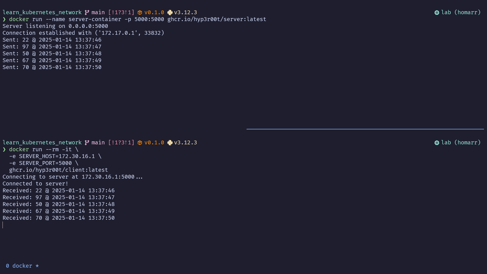

## The Zeroth Step

Make sure docker is installed in your server.

```shell
docker version
```

Then make sure kubernetes is installed (k3s recommended)

```shell
k3s --version
```

Also ensure `kubectl` is installed as it will be the primary command-line tool to interact with the cluster.

```shell
kubectl version
```

## A bit of Story

To understand networking, all we need is two apps: a server app and a client app. For that, I have created two images (read more about them in [Protagonists](./Protagonists.md)).

## Smoke Test

I will guide you through this process that will ensure that your `docker` is working fine and you can pull both the images.

### Pull both the images

```shell
# server
docker pull ghcr.io/hyp3r00t/server:latest

#client
docker pull ghcr.io/hyp3r00t/client:latest
```

### Run the server

```shell
docker run --name server-container -p 5000:5000 ghcr.io/hyp3r00t/server:latest
```

### Run the client

```shell
docker run --rm -it \
  -e SERVER_HOST=172.30.16.1 \
  -e SERVER_PORT=5000 \
  ghcr.io/hyp3r00t/client:latest
```

You need to add your HOST and PORT numbers. 

**Find host number:**

- If you are in Windows run `ipconfig` and figure out the IP address for the docker.
- If you are in Linux run `ip route` and figure out the IP address that has docker group associated with it.

### Result

If everything went well, you will have something similar in your terminal.


